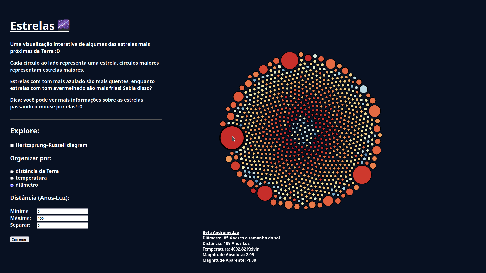

# Star Visualization

Estava com vontadade de experimentar o processo de criar uma visualização interativa. Por esse motivo, fiz este trabalho alternativo, que consiste numa visualização de algumas das principais estrelas mais próximas da Terra. Segue abaixo alguns conceitos que a visualização busca demonstrar:

## Diagrama de HR

O diagrama de Hertzsprung-Russell (HR) é uma ferramenta fundamental na astronomia para representar as propriedades das estrelas. Nesse diagrama, as estrelas são plotadas em um gráfico bidimensional, com o eixo horizontal representando a temperatura efetiva da estrela e o eixo vertical representando a luminosidade ou brilho intrínseco.

No diagrama de HR, as estrelas são classificadas e agrupadas de acordo com sua temperatura e luminosidade. As estrelas de sequência principal, como o nosso Sol, ocupam uma faixa diagonal bem definida, conhecida como a "sequência principal", que representa a fase em que a maioria das estrelas passa a maior parte de suas vidas. À medida que uma estrela evolui, ela pode se deslocar para outras regiões do diagrama, como gigantes vermelhas ou supergigantes, dependendo de sua massa e estágio evolutivo.

## Relação entre cor e temperatura

A cor de uma estrela está diretamente relacionada à sua temperatura efetiva. A temperatura da superfície de uma estrela determina a distribuição de energia dessa radiação. À medida que a temperatura aumenta, o pico da distribuição se desloca para comprimentos de onda mais curtos, ou seja, para a região do azul e do ultravioleta. Portanto, as estrelas mais quentes tendem a ter uma cor azulada, enquanto as mais frias tendem a ter uma cor avermelhada.

## Diâmetro e distância da Terra

A distância e o diâmetro das estrelas são parâmetros importantes para compreender sua escala espacial e tamanho relativo. A distância entre as estrelas é medida em unidades astronômicas, como anos-luz ou parsecs. Essas distâncias são frequentemente estimadas por meio de técnicas como a paralaxe, que mede o aparente movimento da estrela no céu ao longo de um ano terrestre.

Quanto ao diâmetro das estrelas, ele varia consideravelmente, dependendo de sua massa e estágio evolutivo. Estrelas de sequência principal, como o Sol, têm diâmetros relativamente pequenos em comparação com as gigantes vermelhas ou supergigantes, que podem ter diâmetros muito maiores. O diâmetro de uma estrela é uma medida crucial para determinar sua luminosidade e temperatura efetiva, bem como para compreender os processos físicos que ocorrem em seu interior.

## Resumo

Em resumo, o diagrama de Hertzsprung-Russell, a cor das estrelas, a temperatura, a distância e o diâmetro são elementos fundamentais para o estudo e a classificação das estrelas. Essas informações fornecem insights valiosos sobre a evolução estelar, a física envolvida e as propriedades do universo em que vivemos. O estudo desses aspectos contribui para nossa compreensão da formação estelar, da estrutura galáctica e das características dos sistemas estelares em geral.

## A base de dados

A base dados foi obtida por meio de um scrapping do site [Stellar Database](http://www.stellar-database.com/).

## Sobre o processo de criar a visualização

Após obter a base de dados e limpar a mesma, a visualização foi criada a parti da biblioteca D3.js.

## Preview

O site está disponivel em: [Star Visualization](https://vito0182.github.io/star-visualization/). Caso o site não se adeque a tela do dispositivo que você está utilizando, recomendo diminuir ou aumentar o zoom da página. 

